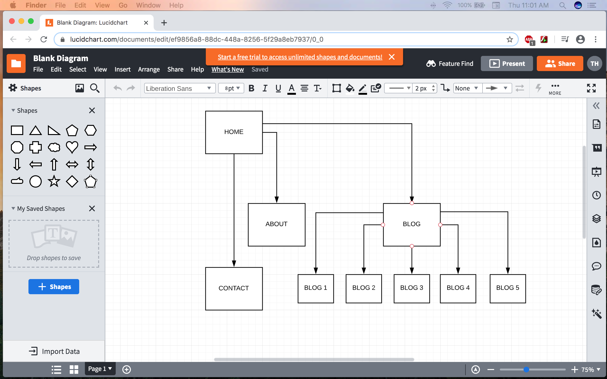
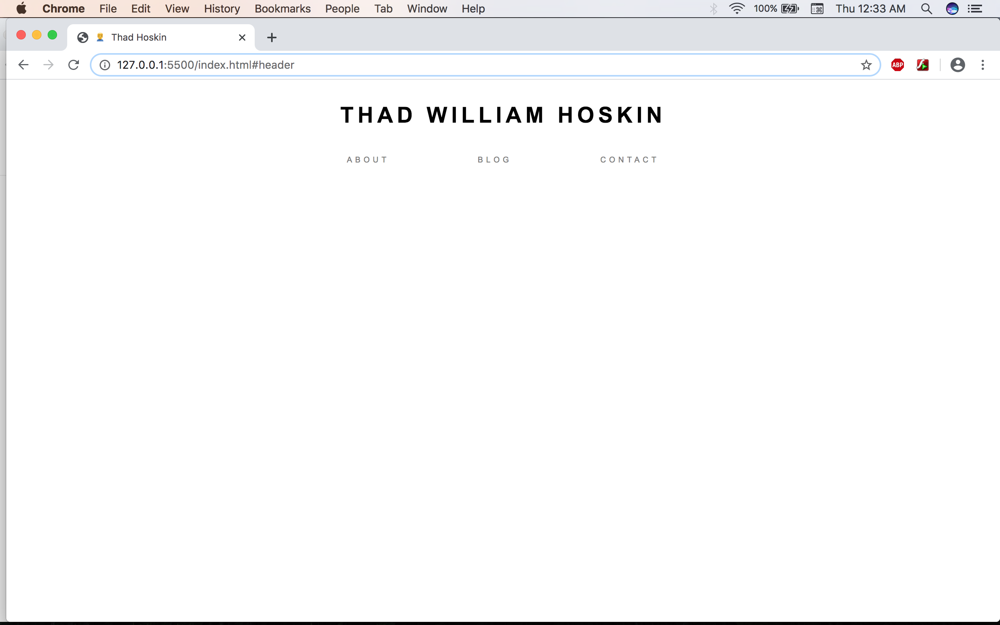
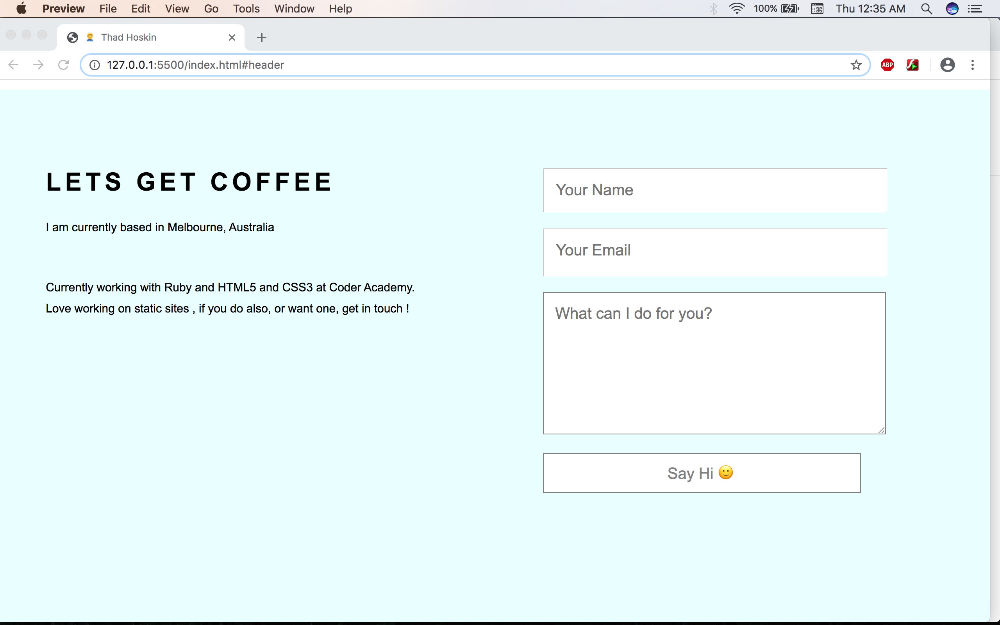
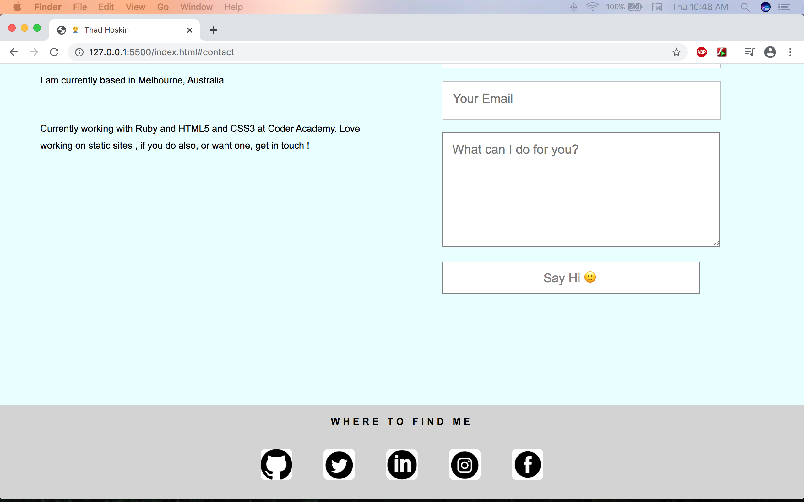
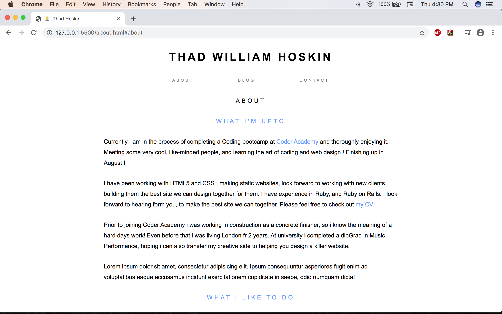
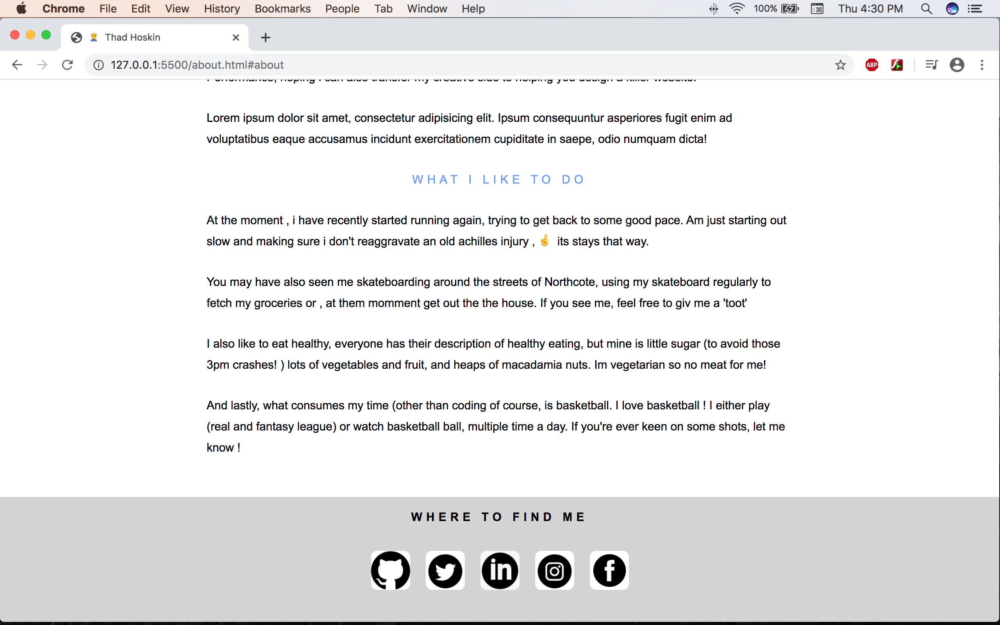
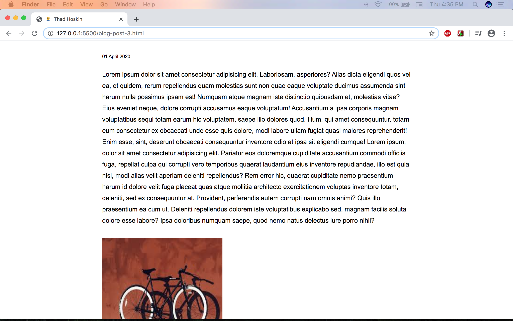
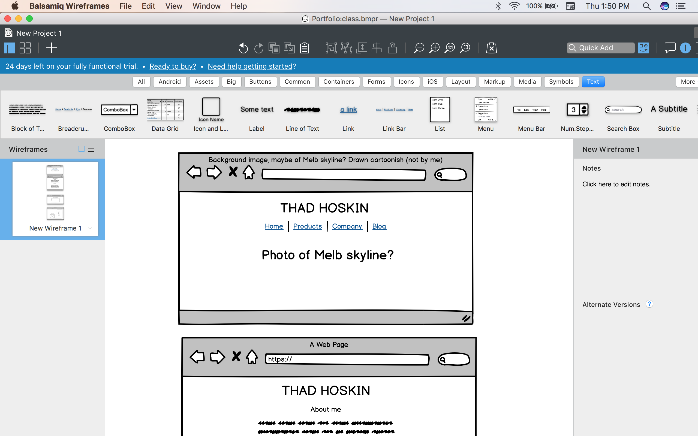
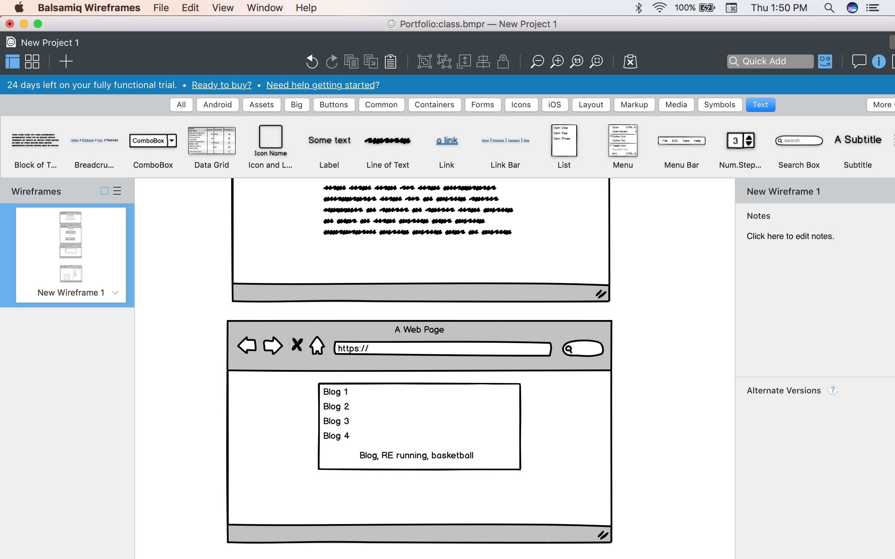
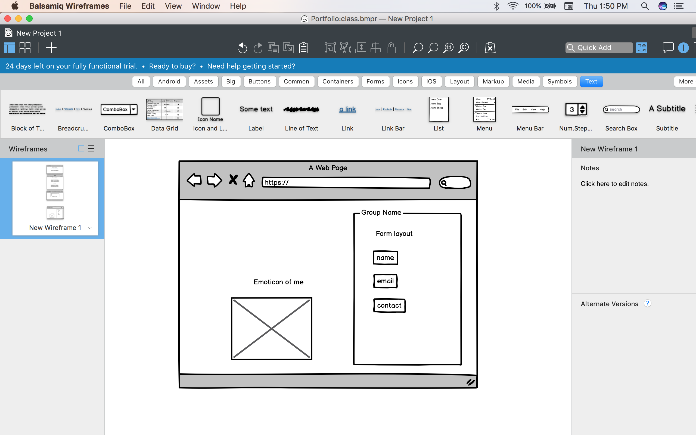

https://optimistic-mclean-8fd100.netlify.com/

https://github.com/ThadHoskin/portfolio-website

# Purpose

When designing this website. my main purpose was to attract people to use my set of skills to help them design their very own website. Another purpose of the website was to showcase the skills that i had learnt during the past 5 weeks at coder academy. 

# Functionality/features

The functionality and UX is a minimalist journey. I myself like minimal websites, the less the better. Functionality being key. I dont want to over stress the eyes. i like black and white websites, with natural colors like lights blues, and grays. The idea behind this is to present strength and power with black and white, as well as a calming effect with using teh neutral colors that i have matched with the black and white. The minimal features i used were, some bolding with the hover tag, as well as some color changes with the hover. The navigation bar easily takes you through the site, being able to return to any page from the page you are on, except for the contact section which is directly below the main page. The 'about' and 'blog' pages are then directed from the main nav. 

# Sitemap

# Screenshots

# Target Audience

My target audience when making this site was any prospective clients as well as any companies that are looking to hire developers.

# Tech stack

For this assignment i used HTML5 and CSS3, using flexbox as well. I used netlify to deploy the website, formspree for the form, to receive emails, balsamiq for the wireframe.  

# Slide

## 
https://www.canva.com/design/DAD4P8CnQ0o/j1ibR2hncRjV5f4hUgAYkg/edit

https://www.canva.com/design/DAD4QHAY6XI/c9efN5Xw0s8EXtNUo7ZPDA/edit

# R7

The structure of my site is simple , it has a navigation bar at the top of each separate html file and you click on them and it will take you to the prompted button. I chose for my layout/navigation to be extremely easy to navigate for UX and also to keep in line with the theme and minimalism. having a 'chunky' page would go against the etho of the site. Clicking on the 'about' page will take you to the page about myself. Easy as. 

# R8

I used a Balsamiq wireframe to help with the design process. I initially had designed there to be an emoticon of myself on the contact page and beside the form, but decided against as it didnt match the theme of the website. I also had planned for the site to be 4 separate main pages, but decided i liked the version of the contact page being below the main page and the user sliding down the page to it. I decided to go wth neutral colors , thta would match the majority of the black and white. i went with gray and light/baby blue. I found these colors to be calming and relaxing on the eyes. 

# R9

Navigation bar: The navigation bar is centered in the middle of all the pages , when the screen is shrunk to mobile a media query is used on the navigation bar to make sure ti fits with the differnt sized screen . 

Layout: I used a 0 auto margin on most pf the pages to center the content material , i believe with the centered text, it keeps the users view on focus of the material at hand. As with the main page, i left it blank, as i couldnt fins an appropriate picture/gif that was minimalist enough to match the theme of the page. Smething that will have to be addressed in the near future. 

Form: I used a form on the contact page for the user to be in touch with me regarding an work tehy want to have me do for them . I again made this simple, i placed a smiley face in the submit button to help diverse the page very slightly, made the input gray and the border gray too. 

Hover: I used hover on some of the anchor tag links to link to other pages, it did this by slightly changing the boldness of the text and having the anchor tag the same color as the header titles on the pages. 
